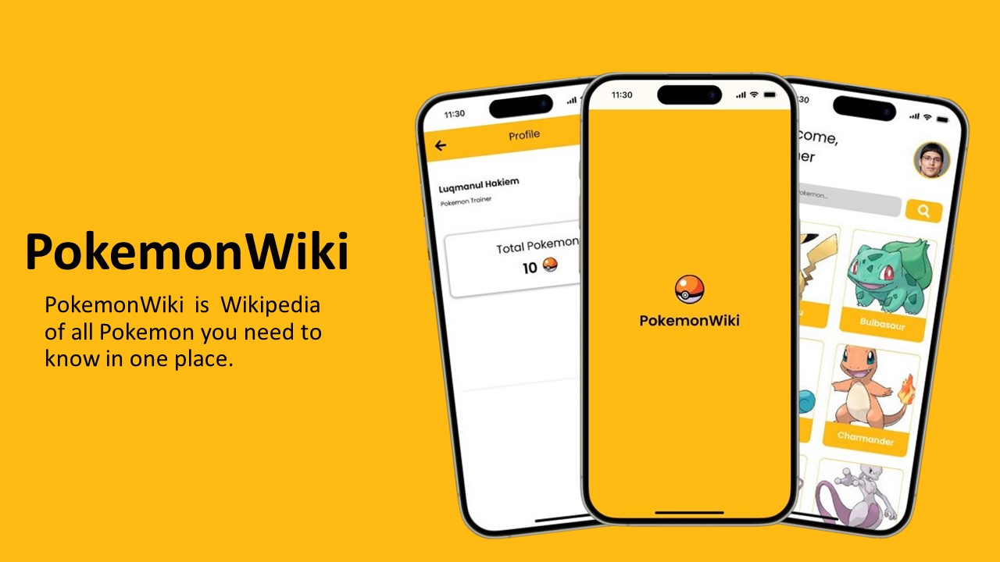

<div align="center">
<h1> PokemonWiki - Wikipedia All Pokemon in one place </h1>
<a href="#">
    
</a>
</div>

# Introduction

>PokemonWiki is Wikipedia of all Pokemon you need to know in one place.

[Link Design](https://www.figma.com/design/HBAANmNzse2qpx8Tze3uxH/PokemonWiki-App?node-id=0-1&t=oOOZ8jhgU9cSFTFy-1)


## Step 1: Start the Metro Server

First, you will need to start **Metro**, the JavaScript _bundler_ that ships _with_ React Native.

To start Metro, run the following command from the _root_ of your React Native project:

```bash
# using npm
npm start

# OR using Yarn
yarn start
```

## Step 2: Start your Application

Let Metro Bundler run in its _own_ terminal. Open a _new_ terminal from the _root_ of your React Native project. Run the following command to start your _Android_ or _iOS_ app:

### For Android

```bash
# using npm
npm run android

# OR using Yarn
yarn android
```

### For iOS

```bash
# using npm
npm run ios

# OR using Yarn
yarn ios
```

If everything is set up _correctly_, you should see your new app running in your _Android Emulator_ or _iOS Simulator_ shortly provided you have set up your emulator/simulator correctly.

This is one way to run your app — you can also run it directly from within Android Studio and Xcode respectively.

# Libraries Used

List of library packages used in this App:

- [React Navigation](https://reactnavigation.org/docs/getting-started/)
- [React Native Svg](https://www.npmjs.com/package/react-native-svg/v/12.3.0)
- [Font Awesome Icon](https://docs.fontawesome.com/web/use-with/react-native)
- [React Native Asset](https://www.npmjs.com/package/react-native-asset)
- [React Native Svg Transformer](https://github.com/kristerkari/react-native-svg-transformer)
